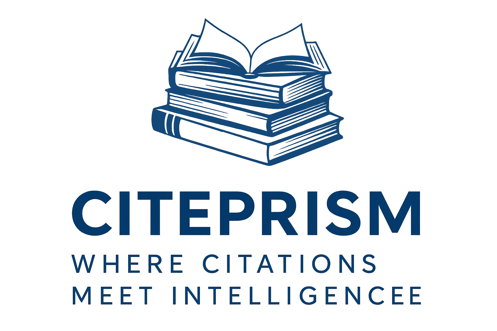
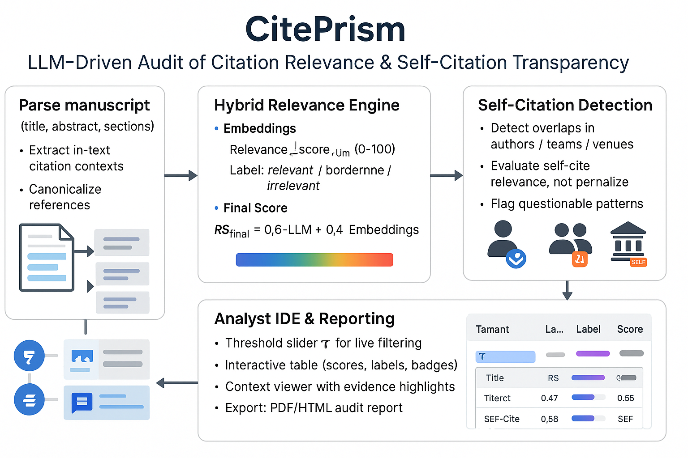

<p align="center">
  
</p>

## 🔍 Overview

**CitePrism** is a transparent, scalable system for auditing academic manuscripts with a focus on:

- **Citation relevance scoring**
- **Self-citation detection**
- **Hybrid LLM + embedding evaluation**
- **Interactive analyst tooling**
- **Audit-ready PDF/HTML reports**

It is designed to support ethical and evidence-based citation practices in scholarly work.

---

<p align="center">
  
</p>

<h1 align="center">CitePrism</h1>
<h3 align="center">LLM-Driven Audit of Citation Relevance & Self-Citation Transparency</h3>

---


## ✨ Key Features

### **1. Hybrid Relevance Engine**
- Embedding-based similarity scoring  
- LLM judgment with evidence extraction  
- Combined metric:  
  `RS_final = 0.6 × LLM_score + 0.4 × Embedding_score`  
- Labels: **relevant**, **borderline**, **irrelevant**

### **2. Self-Citation Transparency**
- Detect overlaps in:  
  - Authors  
  - Teams  
  - Venues  
- Evaluate relevance rather than penalizing  
- Automatic flagging of questionable patterns

### **3. Analyst IDE**
- Threshold slider **τ** for real-time filtering  
- Interactive citation table (scores, labels, badges)  
- Citation-context viewer with highlighted evidence  
- Export: **PDF / HTML** audit report  

---

## 🧱 System Architecture

- **Manuscript Parsing:** Title, abstract, sections, citation contexts  
- **Reference Canonicalization:** Normalize metadata, validate DOIs  
- **Metadata Enrichment:** Crossref, OpenAlex, Semantic Scholar  
- **Explainability:** Evidence spans, keyword overlap, provenance logs  

---

## 📊 Sample Output

- Relevance histogram  
- Self-citation statistics  
- Top flagged citations  
- Full audit table (CSV/JSON/HTML)  

---

## 🚀 Getting Started

### **Install dependencies**
```bash
pip install -r requirements.txt
