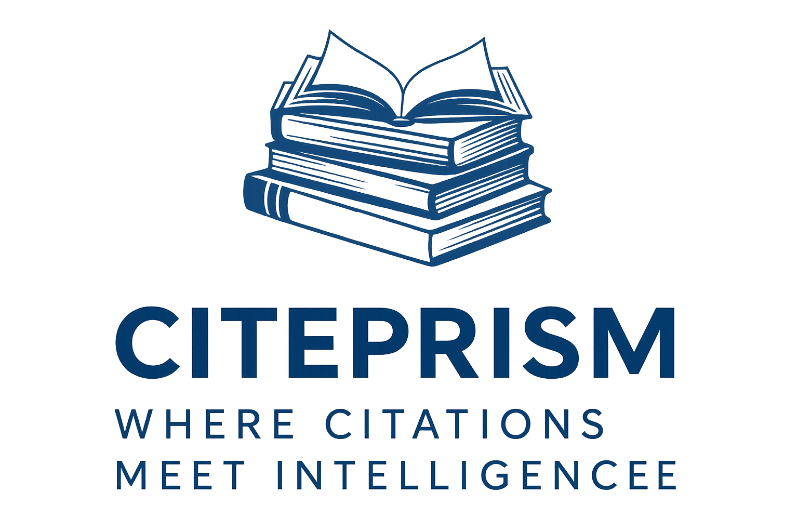
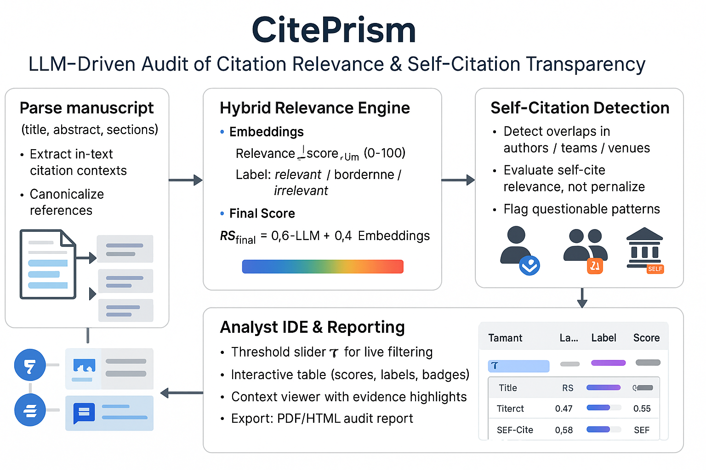
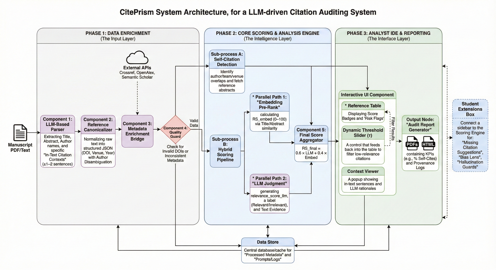

<p align="center">
  
</p>

## 🔍 Overview

**CitePrism** is a transparent, scalable NLP system designed for auditing academic manuscripts. Developed as an M.Sc. Applied Data Science case study, it focuses on:

- **Citation Relevance Scoring**
- **Ethical Self-Citation Detection**
- **Hybrid Evaluation (HuggingFace LLMs + Sentence Embeddings)**
- **Interactive Analyst Tooling (Streamlit IDE)**
- **Audit-ready PDF/HTML Exporting**

CitePrism ensures clarity in scholarly practices by detecting off-topic citations, monitoring bias networks, and generating evidence-based peer-review reports.

---

<p align="center">
  
</p>

<p align="center">
  
</p>
---

## ✨ Core Pipeline Features

### **1. Hybrid Relevance Engine**
- Computes cosine similarity between manuscript and reference abstracts (`RS_embed`).
- Prompts Large Language Models to judge in-text citation context (`RS_llm`).
- Combines metrics using a calibrated formula: `RS_final = 0.6 × LLM_score + 0.4 × Embedding_score`.
- Categorizes citations dynamically into **Relevant**, **Borderline**, or **Irrelevant**.

### **2. Self-Citation Transparency**
- Detects overlaps in Authors, Teams, and Publication Venues.
- Evaluates topical relevance rather than blindly penalizing self-citations (adhering to COPE guidelines).
- Flags questionable "padding" patterns for editorial review.

### **3. The Analyst IDE (User Interface)**
- **Side-by-Side Data Extraction Viewer:** Manually verify extracted metadata and in-text contexts alongside the original PDF.
- **Dynamic Threshold Slider (τ):** Interactively filter low-scoring citations in real-time.
- **Explainability:** Displays exact text evidence, AI rationales, and color-coded status badges.

---

## 🚀 Advanced Diagnostics (Student Enhancements)

This project exceeds baseline requirements by implementing deep-dive bibliometric analytics:

- 🧠 **AI Peer Reviewer (Missing Literature):** Generatively suggests seminal papers that the author missed, complete with rationales for inclusion.
- 🎭 **Citation Intent Analysis:** Semantically classifies *why* a paper was cited (Supporting, Contrasting, Methodology, Background).
- ⏳ **Temporal Currency (Age) Analysis:** Flags manuscripts that rely too heavily on outdated literature (e.g., >10 years old).
- 🕸️ **Network Bias & Diversity Lens:** Uses `PyVis` and `NetworkX` to map interactive, physics-based graphs of the author's citation network, highlighting hidden overlapping cliques.
- 🛡️ **Hallucination Guard:** Cross-verifies parsed PDF text against external API data (OpenAlex/Crossref) to alert analysts to metadata inconsistencies.

---

## 🧱 System Architecture

1. **Document Parsing:** Extracts titles, abstracts, authors, and surrounding in-text citation windows (±2 sentences).
2. **Reference Canonicalization:** Normalizes raw bibliography strings into structured JSON.
3. **Metadata Enrichment:** Queries OpenAlex / Crossref APIs to fetch missing DOIs and abstracts.
4. **Scoring & Insight Generation:** Runs NLP models to generate hybrid scores and semantic insights.
5. **Reporting:** Compiles all findings into professional, downloadable PDF and HTML audit reports.

---

## 💻 Getting Started

### **1. Clone & Install Dependencies**
Ensure you are using Python 3.9+ and run the following commands:
```bash
git clone [https://github.com/your-username/CitePrism.git](https://github.com/your-username/CitePrism.git)
cd CitePrism
pip install -r requirements.txt

```

*(Note: PDF generation requires `fpdf2`. Network graphs require `pyvis` and `networkx`.)*

### **2. Set Environment Variables**

Create a `.env` file in the root directory and add your API keys (e.g., Gemini / HuggingFace):

```text
GEMINI_API_KEY=your_api_key_here

```

### **3. Run the Application**

Launch the interactive Streamlit dashboard:

```bash
streamlit run streamlit_app.py

```

---

*Built for the M.Sc. Applied Data Science Case Study.*
